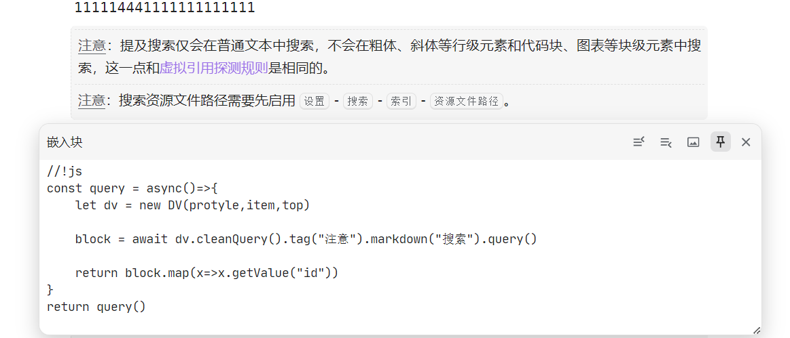
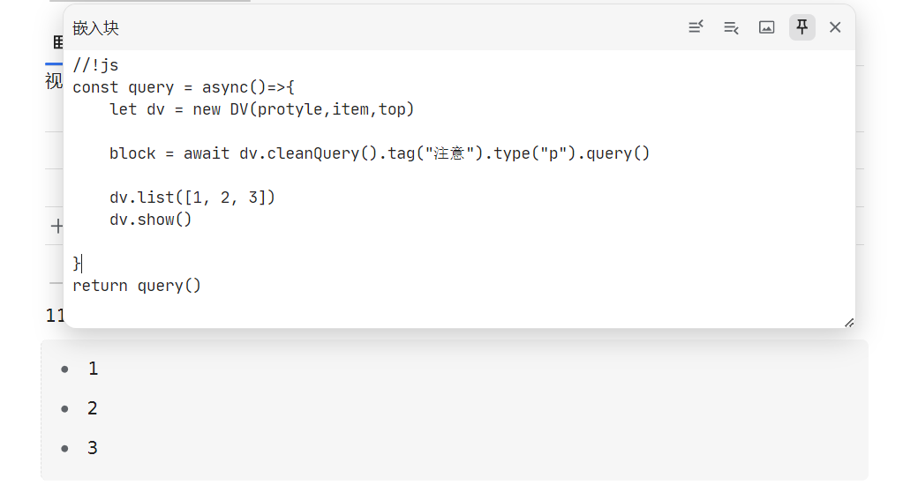
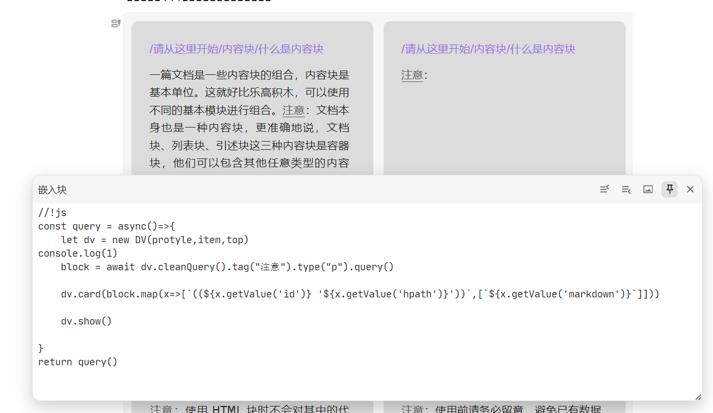
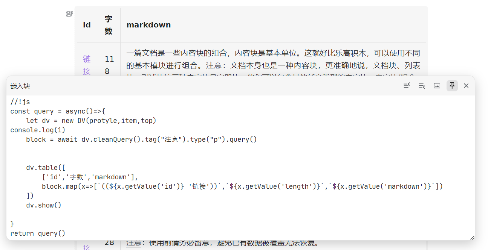
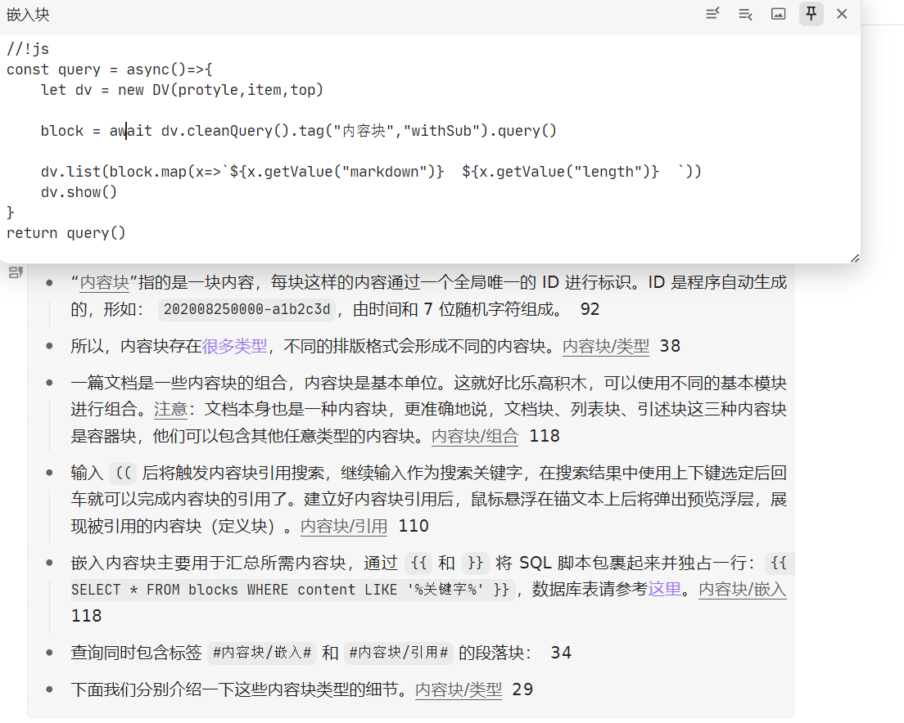
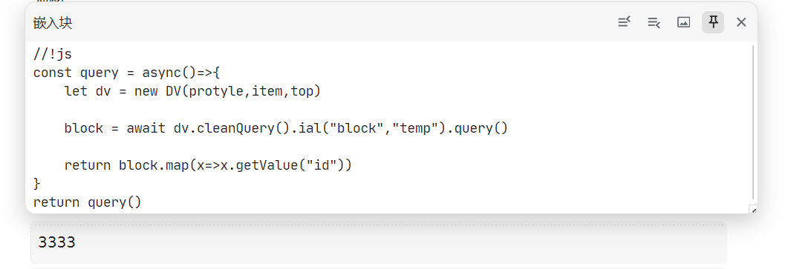
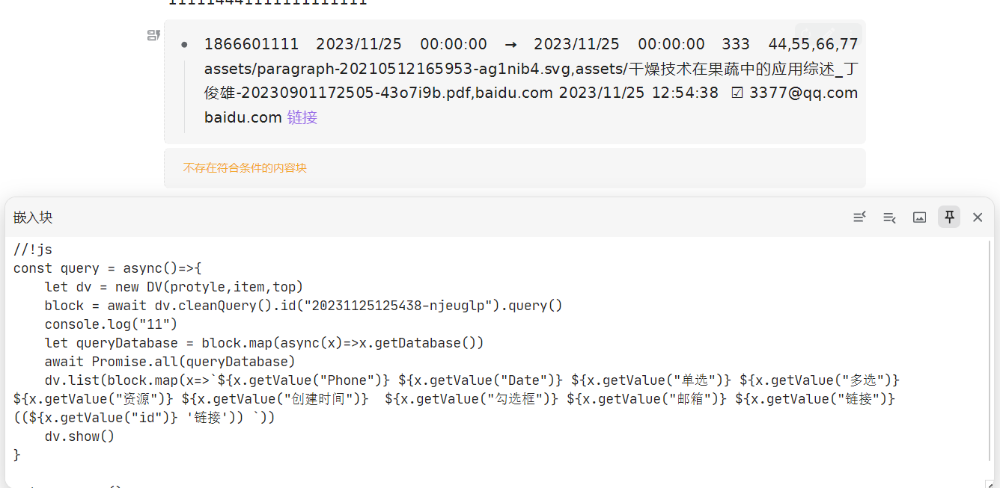

# Auxiliary query plug-in

A plug-in used to reduce the difficulty of writing embedded blocks and increase the display method

Streaming query:

List display:

card display:

table display:

Tag sub-level query:

Custom attribute query:

Property view data acquisition:
