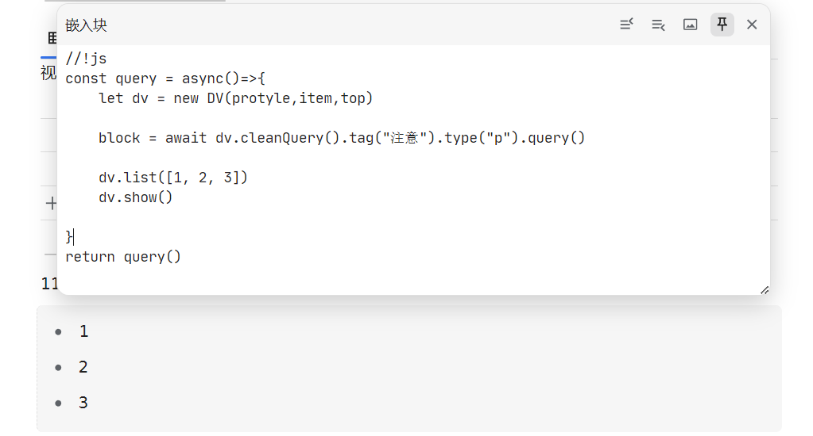

# 辅助查询插件

一个用于减小嵌入块编写难度，增加展示方式的插件

流式查询：


列表展示：



卡片展示：


表格展示：


日历展示：


重复过滤（一炮三响）：


标签子级查询：


自定义属性查询：


属性视图数据获取：


<video controls src="./asset/dataquery-with-database.mp4" title="Title"></video>

## 更新日志

v0.0.6增加出链反链查询，原型如下：
```js
outlinks(blockArg:string|string[]|DataViewBlock|DataViewBlock[]|undefined)
backlinks(blockArg:string|string[]|DataViewBlock|DataViewBlock[]|undefined)
```

## api 参考

这个插件向全局暴露一个变量，DV，即 DataView 的缩写（你也可以看成是对 siyuan 笔记开发者 D、V 的致敬）。这个变量是 Dataview 类的构造函数。

它继承了 DataQuery 类，所以可以直接使用 DataQuery 的方法。

初始化

```javascript
let dv = new DV(protyle,item,top) 
```

### DataView 类

#### 属性

* `protyle: IProtyle` - 一个接口类型的属性，代表一个 Protyle 对象。
* `item: HTMLElement` - 一个 HTML 元素，用于表示一个项目。
* `top: number | null` - 一个数字或者 null，用于表示顶部位置。
* `lute: Lute` - 一个 Lute 对象。
* `container: HTMLElement` - 一个 HTML 元素，用于表示容器。

#### 构造函数

* `constructor(protyle: IProtyle, item: HTMLElement, top: number | null)` - 构造函数，接受一个 protyle 对象、一个 HTML 元素和一个数字或 null 作为参数。

#### 静态方法

* `static DataQuery(): DataQuery` - 返回一个新的 DataQuery 对象。
* `static DataViewBlock(blockItem: { block: IBlock, blockPaths: IBreadcrumb[] }, sqlData: Block): DataViewBlock` - 返回一个新的 DataViewBlock 对象。

#### 方法

* `addElement(CustomEmbed: HTMLElement | string)` - 向容器中添加自定义嵌入元素。
* `addMarkdown(md: string)` - 向容器中添加 Markdown 内容。
* `list(data: any[])` - 向容器中添加列表数据。
* `card(data: any[])` - 向容器中添加卡片数据。
* `table(data: any[])` - 向容器中添加表格数据。
* `data:DataViewBlock[]|any[], option:{
  type:"custom"|'database'|"block"
  blockType:"updated"|"created"|"between",
  queryKey:null|string|string[]
  }|null` - 向容器中添加日历数据。
* `show()` - 显示容器内容。

##### DataView.list

示例：

```javascript
//!js
const query = async()=>{
    let dv = new DV(protyle,item,top)
    dv.list([1,2,3])
    dv.show()
}
return query()
```

传入一个 Array 列表，会尝试将列表里的元素转换为 string，并转换为列表

##### DataView.card

示例：

```javascript
//!js
const query = async()=>{
    let dv = new DV(protyle,item,top)
    dv.card([
	[1,[222, 'aaa']],
	[3,[444, 'bbb']]
    ])
    dv.show()
}
return query()
```

传入一个[header, body[]] []列表，header 作为标题，body 里的每一项会作为卡片的内容。

##### DataView.table

示例：

```javascript
//!js
const query = async()=>{
    let dv = new DV(protyle,item,top)
    dv.table([
    ['a', 'b', 'c'],
    [
        ['a1', 'b1', 'c1'],
        ['a2', 'b2', 'c2'],
        ['a3', 'b3', 'c3'],
    ]
    ])
    dv.show()
}
return query()
```

传入一个[header, body[]] ，header 作为标题，body 里的每一项会作为表格的一行。

##### DataView.calendar

参数

* `data: DataViewBlock[] | any[]` - 一个 DataViewBlock 对象数组或任意其他类型的数组，用于表示日历数据。
* `option: { type: "custom" | 'database' | "block", blockType: "updated" | "created" | "between", queryKey: null | string | string[] } | null` - 一个对象，包含了日历类型、块类型、查询键等参数，或者可以为 null。

  * 当 option 为 null 时，默认为：

    ```js
    option = {
        type:"block",
        blockType:"created",
        queryKey:null
    }
    ```

示例

```js
//!js
//搜索未完成的任务
const query = async()=>{
    let dv = new DV(protyle,item,top)
    let blocks = await dv.markdown('* [ ]').type('i').query()
    dv.calendar(blocks)
    dv.show()
}
return query()
```

```js
//!js
//搜索完成的任务还有创建和完成的日期
const query = async()=>{
    let dv = new DV(protyle,item,top)
    let blocks = await dv.markdown('* [x]').type('i').subtype('t').query()
    dv.calendar(blocks,{
        type:"block",
        blockType:"between",
        queryKey:null
    })
    dv.show()
}
return query()
```

```js
//!js
// 查询 id 为 20231201150318-hf3xoms 的数据库中的块
// 并以'Date','创建时间'为起止日期
const query = async()=>{
    let dv = new DV(protyle,item,top)
    let blocks = await dv.ial('avs','20231201150318-hf3xoms').query()
  
    // 查询数据库
    let dataQuery = blocks.map(x=>x.getDatabase())
    await Promise.all(dataQuery)

    dv.calendar(blocks,{type:'database',queryKey:['Date','创建时间']})
    dv.show()
}
return query()
```

详细说明

* 该函数用于向容器中添加日历数据展示元素。
* 参数 `data` 可以是一个 DataViewBlock 对象数组，也可以是任意其他类型的数组。
* 参数 `option` 是一个对象，用于指定日历类型、块类型、查询键等参数。如果 `option` 为 null，则会使用默认的值。
* 函数内部根据 `option` 的值进行不同的逻辑处理，包括根据不同的类型和查询键来构建日历数据。
* 最后，使用一个名为 `Calendar` 的组件，将构建好的日历数据添加到一个新创建的 `calendarContainer` 中，并将 `calendarContainer` 添加到 DataView 的容器中。
* 使用 custom 类型需要自定义输入， data 需要满足类型：

  * ```js
    data:{
            start: string|Date;
            end:string|Date|null;
            title: {html:string}|string|{domNodes: Node[]},
            resourceIds: string[],
            color:string
        }[] 
    ```

### DataQuery 类

#### 属性

* `SQLstmt: string` - 用于存储 SQL 语句的私有属性。
* `queryList: Query[]` - 用于存储查询列表的私有属性。
* `limitNumber: number` - 用于存储查询限制数量的私有属性。
* `blockList: DataViewBlock[]` - 用于存储数据视图块的属性。

#### 构造函数

* `constructor(): void` - 构造函数，初始化 SQLstmt、queryList 和 limitNumber 属性。

#### 方法

* `async query(): Promise<DataViewBlock[]>` - 执行查询并返回数据视图块列表。
* `sql(SQLstmt: string): this` - 设置 SQL 语句。
* `cleanQuery(): this` - 清空查询列表和 SQL 语句。
* `id(id: any, operator: string = "like"): this` - 添加 id 查询条件。
* `parent_id(parent_id: any, operator: string = "like"): this` - 添加 parent_id 查询条件。
* `root_id(root_id: any, operator: string = "like"): this` - 添加 root_id 查询条件。
* `hash(hash: any, operator: string = "like"): this` - 添加 hash 查询条件。
* `box(box: any, operator: string = "like"): this` - 添加 box 查询条件。
* `path(path: any, operator: string = "like"): this` - 添加 path 查询条件。
* `hpath(hpath: any, operator: string = "like"): this` - 添加 hpath 查询条件。
* `name(name: any, operator: string = "like"): this` - 添加 name 查询条件。
* `alias(alias: any, operator: string = "like"): this` - 添加 alias 查询条件。
* `memo(memo: any, operator: string = "like"): this` - 添加 memo 查询条件。
* `tag(tag: any, operator: string = "like"): this` - 添加 tag 查询条件。
* `content(content: any, operator: string = "like"): this` - 添加 content 查询条件。
* `fcontent(fcontent: any, operator: string = "like"): this` - 添加 fcontent 查询条件。
* `markdown(markdown: any, operator: string = "like"): this` - 添加 markdown 查询条件。
* `length(length: any, operator: string = "like"): this` - 添加 length 查询条件。
* `type(type: any, operator: string = "like"): this` - 添加 type 查询条件。
* `subtype(subtype: any, operator: string = "like"): this` - 添加 subtype 查询条件。
* `ial(ialKey: any, ialValue: any, operator: string = "like"): this` - 添加 ial 查询条件。
* `sort(sort: any, operator: string = "like"): this` - 添加 sort 查询条件。
* `created(created: any, operator: string = "like"): this` - 添加 created 查询条件。
* `updated(updated: any, operator: string = "like"): this` - 添加 updated 查询条件。
* `limit(limit: number): void` - 设置查询限制数量。
* `buildSQLstmt(queryList: Query[]): string` - 根据查询列表构建 SQL 语句。
* `buildBlockList(iblocks: BlockItem[], sqlData: Block[]): DataViewBlock[]` - 根据 BlockItem 和 Block 数据构建数据视图块列表。
* `uniBlocks(blocks: DataViewBlock[], mode: 'max' | 'min'): DataViewBlock[]` - 根据模式过滤数据视图块列表。

##### DataQuery.id, parent\_id ... updated

链式查询函数，在添加多个查询条件后与 `query` 连用。

##### DataQuery.query

异步函数，使用类自身的 `SQLstmt` 或 `queryList` 构建查询语句，调用思源 api 查询，并返回 `blockList: DataViewBlock[]`，同时将 `blockList: DataViewBlock[]` 储存在 DataQuery 实例中。

示例：

```js
//!js
let query = async ()=>{
    let dq = DV.DataQuery()
    let blocks = await dq.markdown('内容块').markdown('思源').query()
    return blocks.map(x=>x.getValue('id'))
}
return query()
```

##### DataQuery.uniBlocks

解决一炮三响重复问题， min 模式为保留最小独立块，max 为保留最大公共块。

示例

```js
//!js
let query = async ()=>{
    let dq = DV.DataQuery()
    let blocks = await dq.markdown('内容块').markdown('思源').query()
    blocks = dq.uniBlocks(blocks, 'max')
    return blocks.map(x=>x.getValue('id'))
}
return query()
```

#### Query 接口

* `type: string` - 查询类型。
* `value: any` - 查询值。
* `operator: string` - 查询操作符。

### DataViewBlock 类

#### 属性

* `databaseAttr: AV[]` - 数据库属性数组。
* `sqlData: Block` - SQL 数据。
* `blockItem: BlockItem` - 数据视图块项。

#### 构造函数

* `constructor(blockItem: { block: IBlock, blockPaths: IBreadcrumb[] }, sqlData: Block): void` - 构造函数，初始化数据视图块项和 SQL 数据。

#### 方法

* `get dom(): string` - 获取块的 DOM 内容。
* `getValue(key: string): any` - 根据键名获取块中的值。在查询数据库属性时，如果未调用`getDatabase`未查询获取块的数据库属性，会得到一个promise
* `getValueFromSql(key: string): any` - 从 SQL 数据中获取指定键名的值。
* `getValueFromIal(key: string): any` - 从块项的 IAL 中获取指定键名的值。
* `getValueFromDatabase(key: string): Promise<DatabaseValue>` - 从数据库中获取指定键名的值，返回一个 DatabaseValue
* `getDatabase(): Promise<void>` - 异步函数，调用思源api，查询获取块的数据库属性

### DatabaseValue

#### 属性

* `name: string`：表示数值的名称。
* `type: string`：表示数值的类型。
* `id: number`：表示数值的ID。
* `keyID: string`：表示数值对应的键ID。
* `blockID: string`：表示数值对应的块ID。
* `values: Data['values']`：表示数值的具体数值数据。

#### 构造函数

* `constructor(data: Data)`：构造函数接受一个类型为 `Data` 的参数，该参数包含了数值的相关数据。在构造函数中，会根据传入的数据初始化类的属性。

#### 方法

* `value: any`：获取数值的值。
* `toString(): string`：将数值转换为字符串并返回。